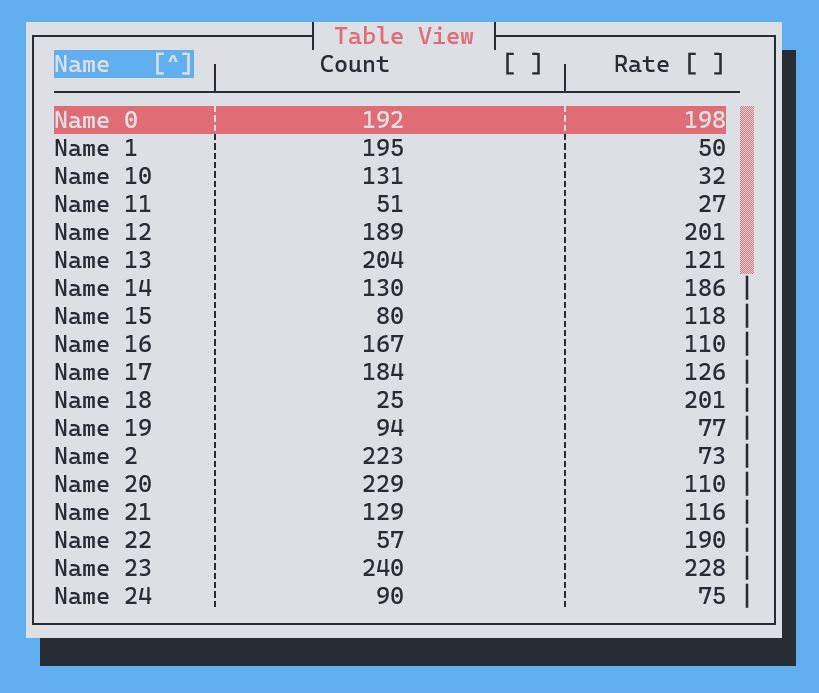
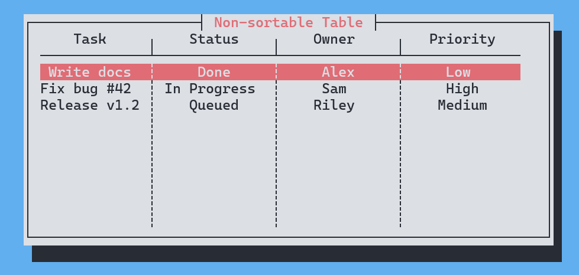
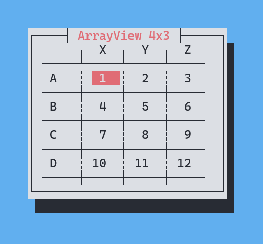

# better_cursive_table

TableView and ArrayView widgets for the [cursive](https://crates.io/crates/cursive) TUI framework.
This is a maintained fork of [cursive_table_view](https://github.com/BonsaiDen/cursive_table_view)
with all original functionality plus a toggle to disable sorting and header selection.

Links: [crates.io](https://crates.io/crates/better-cursive-table) | [docs.rs](https://docs.rs/better-cursive-table) | [GitHub](https://github.com/justnc32/better-cursive-table)

## Highlights

- TableView with multi-column sort and keyboard/mouse navigation
- ArrayView for labeled rows + columns (a 2D grid with headers)
- Chainable column configuration (alignment, width, default order)
- Callbacks for sort, row select, and submit
- Optional non-sortable mode for "static" tables






## Quick start (TableView)

```rust
use better_cursive_table::TableBuilder;

let table = TableBuilder::new()
    .column_header(vec!["A", "B", "C"])
    .data(vec![vec![1, 3, 10], vec![2, 1, 42]])
    .sortable(true)
    .build();
```

## Sorting disabled

Disable header selection and sort indicators entirely:

```rust
use better_cursive_table::TableBuilder;

let table = TableBuilder::new()
    .column_header(vec!["A", "B"])
    .data(vec![vec![1, 3]])
    .sortable(false)
    .build();
```

## ArrayView (row + column headers)

```rust
use better_cursive_table::ArrayBuilder;

let array = ArrayBuilder::new()
    .array_name("My Array")
    .column_header(vec!["X", "Y", "Z"])
    .add_row("Row A", vec![1, 2, 3])
    .add_row("Row B", vec![4, 5])
    .build();
```

## Callbacks

```rust
use std::cmp::Ordering;
use better_cursive_table::TableBuilder;

let table = TableBuilder::new()
    .column_header(vec!["A"])
    .data(vec![vec![1]]).build()
    .on_sort(|_siv, _col, _order: Ordering| {})
    .on_select(|_siv, _row, _index| {})
    .on_submit(|_siv, _row, _index| {});
```

## License

Licensed under either of:

- Apache License, Version 2.0 ([LICENSE-APACHE](LICENSE-APACHE) or http://www.apache.org/licenses/LICENSE-2.0)
- MIT license ([LICENSE-MIT](LICENSE-MIT) or http://opensource.org/licenses/MIT)

### Contribution

Unless you explicitly state otherwise, any contribution intentionally submitted
for inclusion in the work by you shall be dual licensed as above, without any
additional terms or conditions.
